# AI Rules Architecture Overview

Interactive visualization of agents, MCPs, tools, skills, and infrastructure in the ai-rules system.

**🔗 [Open Visualization](./index.html)** — Click to view the full architecture diagram in your browser.

## Files

- `index.html` — Interactive visualization engine (loads data dynamically from YAML)
- `data.yaml` — Generated node and configuration data for the graph
- `README.md` — This file

## Quick Start

The page uses `fetch()` to load `data.yaml`, so it must be served over HTTP (not opened as a `file://` URL).

```sh
# Serve and open in browser (runs on http://localhost:8888)
./agents-overview/serve.sh
```

Click any card to expand and see detailed information — constraints, responsibilities, tools, and configuration.

## Code intelligence boundary

The visualization follows the current tool boundary:

- **RTK/native OpenCode tools** — default and authoritative for exact text/files,
  shell, tests, Git, configuration, documentation, and edits.
- **RTK/native OpenCode tools** — authoritative for exact local inspection,
  shell commands, tests, configuration, documentation, and edits.
- **Assigned MCPs and CLIs** — available only to the agents listed in the
  runtime configuration; this overview does not infer unlisted access.

The generated inventory preserves unrelated access: Orchestrator has `github`,
Designer has `figma-mcp`, Librarian has `context7`, `websearch`, `gh_grep`,
`linear`, and `cortex`, and Sage has `cortex`. Access not listed in this
summary remains governed by the authoritative runtime configuration.

Rulesync owns the skills under `.rulesync/skills/` and projects them to the
generated global output. Unmanaged unrelated vendor skills are preserved.

## Serena semantic MCP and worktree ownership

Serena is the active semantic MCP for OpenCode IDE sessions. GitNexus is
removed and is not an authority or part of this inventory's lifecycle. Serena
uses only OpenCode's `ide` context over stdio; its dashboard and browser are
disabled, and VS Code integration is deferred. Install the pinned version with:

```zsh
uv tool install -p 3.13 serena-agent==1.7.0
```

Worktrunk creates or enters worktrees but does not own Serena's lifecycle: it
does not start, index, stop, or clean Serena. OpenCode starts Serena with
`--context ide --project-from-cwd`; Serena resolves the nearest
`.serena/project.yml` or `.git` boundary, and each client session owns one
stdio process. The parent worktree's `.serena/project.yml` is complete,
generated, and read-only; all other `.serena` runtime files are ignored.

Launching from nested `ai-rules` selects its nested Git boundary and does not
inherit the parent `.serena/project.yml`. Nested configuration is deferred
because Worktrunk worktrees need no changes inside it.

## Dispatch Graph

The following static Mermaid diagram is the high-level agent-to-agent dispatch map. The rendered version appears above the cards in `index.html`; it intentionally excludes MCPs, skills, tools, infrastructure, runtime data, and card interactions.

```mermaid
flowchart TD
    ORCH[Orchestrator] --> ORACLE[Oracle]
    ORCH --> EXPLORER[Explorer]
    ORCH --> LIBRARIAN[Librarian]
    ORCH --> DESIGNER[Designer]
    ORCH --> FIXER[Fixer]
    ORCH --> OBSERVER["Observer (auto-routes images)"]
    ORCH --> NAVIGATOR[Navigator]
    ORCH --> DETECTIVE[Detective]
    ORCH --> SAGE[Sage]
    ORCH --> REVIEWERCODE["Reviewer Code (Phase A)"]
    ORCH --> REVIEWERTEST["Reviewer Test (Phase A, if tests/behavior)"]
    ORCH --> REVIEWERERRORS["Reviewer Errors (Phase A, if errors)"]
    ORCH --> REVIEWERTYPES["Reviewer Types (Phase A, if types)"]
    ORCH --> REVIEWERSECURITY["Reviewer Security (Phase A, if security)"]
    ORCH --> REVIEWERPERFORMANCE["Reviewer Performance (Phase A, if performance)"]
    ORCH --> REVIEWERDATA["Reviewer Data Integrity (Phase A, if data)"]
    ORCH --> REVIEWERACCESSIBILITY["Reviewer Accessibility (Phase A, if UI)"]
    ORCH --> REVIEWERCOMMENTS["Reviewer Comments (Phase A, if docs)"]
    ORCH --> REVIEWERSIMPLIFIER["Reviewer Simplifier (Phase B, once sequentially)"]
```



OpenCode implementation scheduling is bounded separately from reviewer
scheduling: the orchestrator may dispatch at most **3** independent
`@fixer` children with `background=true` in one batch. It waits for the same
batch, reconciles exact returned child session IDs with `task_result`, and
requires a passing review for every `DONE` child before releasing dependents.
Overlapping, ambiguous, shared, generated, lockfile, and ordered work remains
serial. Each fixer receives a hard `Files` write allowlist; because OpenCode
does not expose dynamic per-task path ACLs, changed-path smoke evidence rejects
unowned writes. Failed, timed-out, `NEEDS_CONTEXT`, `BLOCKED`, missing, or
malformed results hold dependents and are surfaced.

The OpenCode orchestrator delegates the complete review packet to
the orchestrator-owned `review-pipeline`; it does not preload the review-pipeline skill in ordinary sessions.
The orchestrator dispatches applicable concern lanes in independent background
batches. After Phase A completes, reviewer-simplifier runs exactly once
sequentially only when selected/applicable—when the normalized diff contains a
non-empty executable/source/config diff and the aspect filter permits it—and
receives the consolidated Phase A findings. The runtime setting
`REVIEWER_MAX_PARALLEL` controls each concern batch; unset or invalid values
default to `3`, values from `1` through `3` are used, and values above `3`
are clamped to `3`. Any non-empty lane `errors` array makes Review Health
Degraded/inconclusive.
OpenCode review commands run through the orchestrator-owned `review-pipeline`, which returns one
inline Markdown report containing telemetry, triggered/skipped lanes,
batches/session IDs, timing, native RTK/OpenCode tools status/fallback, Review Health, verdict,
prioritized findings, strengths, and recommended action. The ten `reviewer-*`
agents are read-only leaf lanes; they do not load the review-pipeline skill or
dispatch further tasks. Failed, timed-out,
unavailable, malformed, or incomplete results remain lane errors, while valid
findings from other lanes are retained without invented citations.

Review policy defaults are target-aware: current diff/task uses `auto`; entire
branch, branch, and PR uses `full`; explicit tagged `auto`, `full`, or `aspects`
overrides the default, and textual `all` normalizes to `full`. Review evidence
comes from the complete packet and native RTK/OpenCode reads.

## Model Routing and Reasoning Variants

The model values shown in this overview are declared directly in the active
`bifrost` preset and custom agents in `oh-my-opencode-slim.json`. That file is
the sole model configuration; `opencode.json` remains the provider catalog.
Each agent's model and optional reasoning variant are kept together in OMO.

## Using the Visualization

**Navigation:**

- **Click cards** to expand/collapse and see full details
- **Scroll** to browse all sections
- **Responsive** — works on desktop and mobile

**Color coding:**

- Blue boxes — Agents
- Purple badges — MCPs
- Green badges — Tools
- Amber badges — Skills
- Pink boxes — Infrastructure

## Updating the Architecture

The source configuration is authoritative; `data.yaml` is generated output.
After changing agents, MCP assignments, or OMO model assignments, regenerate it with:

```sh
python3 scripts/update-agents-overview-data.py
```

No code changes are needed for visualization updates.

### Node Fields

```yaml
nodes:
  - id: unique-id # Required: unique identifier
    label: Display Name # Required: shown in UI
    type: agent|mcp|tool|skill|infra # Required: node category
    role: Brief role description # Required: 1-line summary
    color: "#hexcolor" # Required: badge/box color
    parent: parent-id # Optional: nesting (agent contains MCPs)
    trigger: When to dispatch # Agents: conditions for dispatch
    tools: Tool names # Agents: available MCPs/tools
    constraints: Cannot access X # Agents: access restrictions
    responsibilities: What it does # Agents: bullet-point list
    description: Brief description # Tools/Skills: what it does
    used_by: Which agents # Tools: who uses it
    when: When to invoke # Skills: when to use
    location: File path # Infrastructure: config location
    config: Configuration details # Infrastructure: setup details
```

### Adding an Agent

```yaml
nodes:
  - id: my-agent
    label: my-agent
    type: agent
    role: Specific purpose
    color: "#60a5fa"
    parent: main
    trigger: Conditions to dispatch
    tools: List of available MCPs
    constraints: Access restrictions
    responsibilities: |
      • Responsibility 1
      • Responsibility 2
```

### Adding an MCP

```yaml
nodes:
  - id: my-mcp
    label: my-mcp-name
    type: mcp
    role: What it provides
    color: "#a78bfa"
    parent: agent-id # Which agent owns it
```

### Adding a Tool

```yaml
nodes:
  - id: my-tool
    label: My Tool
    type: tool
    role: What it does
    color: "#34d399"
    parent: null
    description: Detailed description
    used_by: Which agents use it
```

### Adding Infrastructure

```yaml
nodes:
  - id: my-config
    label: Config Name
    type: infra
    role: What it configures
    color: "#f472b6"
    parent: null
    location: ~/.config/file.json
    config: |
      • Configuration option 1
      • Configuration option 2
```

## Maintenance & Sync

### When to Update `data.yaml`

Update the visualization whenever you change:

- Add/remove/rename agents in `.rulesync/subagents/`
- Modify MCPs or tool access in `.rulesync/rules/`
- Change subagent dispatch rules in `oh-my-opencode-slim.json`
- Update infrastructure/config in `.rulesync/mcp.jsonc`
- Modify skills in the global rules

### OpenCode Instruction

Add this reminder to `.rulesync/rules/custom-rules.md` or your memory:

```markdown
## Architecture Visualization

Keep `agents-overview/data.yaml` in sync with agent/MCP/tool changes:

- Agent added? → update nodes, add trigger/constraints/responsibilities
- MCP access changed? → update parent/constraints
- Dispatch rules modified? → update agent's trigger conditions
- Tool permissions updated? → update tool's used_by field
- Infrastructure config changed? → update infra node details

Changes are immediately reflected in the visualization at `agents-overview/index.html`.
```

### Quick Reference

After any agent/MCP/tool changes:

1. Update the tracked source configuration
2. Run `python3 scripts/update-agents-overview-data.py`
3. Refresh `index.html` in browser
4. Verify visualization matches actual system

No code needed—YAML drives everything.

## Architecture

### Agents

**Built-in (Pantheon):**

- **orchestrator** — Master delegator; plans, dispatches the appropriate implementation specialist (@fixer or @designer), and coordinates/reviews results
- **oracle** — Strategic advisor; architecture review, hard debugging, code review
- **explorer** — Codebase reconnaissance; broad searches, pattern discovery
- **librarian** — Knowledge retrieval; library docs (context7), web search, Linear, Gorgias internal docs/Notion (via Cortex), GitHub code search
- **designer** — UI/UX implementation; visual components, frontend polish, Figma Desktop
- **fixer** — Bounded implementation; scoped bug fixes and mechanical code changes within a hard declared `Files` allowlist; up to three independent children may run per OpenCode batch
- **observer** — Visual analysis; images, screenshots, PDFs (auto-routed from orchestrator)

**Custom:**

- **navigator** — Browser automation via the agent-browser CLI; snapshots/refs, navigation, screenshots, forms, extraction
- **detective** — Production diagnostics; Datadog (pup CLI), GCP logs (gcloud), root cause analysis (Sentry/Rootly/Notion reported unavailable)
- **sage** — Domain knowledge; Gorgias metrics, table schemas, business rules (cortex)
- **review-pipeline** — orchestrator-owned review protocol; defines target-aware policy, ten-lane scheduling, aggregation, and verdict
- **reviewer-code** — Always-on general correctness and project-guideline review
- **reviewer-test** — Behavioral test coverage (test files or uncovered production behavior)
- **reviewer-errors** — Error, retry, fallback, and failure-propagation review
- **reviewer-types** — Type, interface, class, schema, and invariant review
- **reviewer-security** — Authentication, authorization, secrets, input safety, and security boundaries
- **reviewer-performance** — Algorithms, queries, I/O, allocations, concurrency, and hot paths
- **reviewer-data-integrity** — Persistence, transactions, migrations, idempotency, and state integrity
- **reviewer-accessibility** — WCAG and UI accessibility review
- **reviewer-comments** — Comment, documentation, example, and explanatory-text review
- **reviewer-simplifier** — Post-Phase-A clarity and maintainability pass

### MCPs (Model Context Protocol)

**orchestrator:**

- **RTK/native OpenCode tools** — Exact local inspection, shell, tests,
  configuration, documentation, and edits
- **github** — GitHub CLI integration (PRs, issues, checks)

**oracle / explorer / detective / reviewer-* lanes:**

- **RTK/native OpenCode tools** — Exact local inspection and source confirmation

**designer:**

- **figma-mcp** — Design files (local Figma Desktop app, http://127.0.0.1:3845/mcp)

**fixer:**

- Native-only in the current OMO configuration; no MCP is assigned

**reviewer-* lanes:**

- Read-only specialist lanes; native OpenCode tools remain authoritative for
  exact local work

**librarian:**

- **context7** — Current library documentation
- **websearch** — Web search via Exa
- **gh_grep** — GitHub code search across repos
- **linear** — Issues, epics, cycles (read-only)
- **cortex** — Gorgias internal docs, specs, runbooks (read-only)

**detective:**

- **pup CLI** — Datadog CLI (--agent --ro): logs, metrics, APM, monitors
- **gcloud CLI** — GCP Cloud Logging (Bash, no enabled MCP)

**sage:**

- **cortex** — Gorgias domain knowledge, metrics, BigQuery

**librarian:**

- **context7**, **websearch**, **gh_grep**, **linear**, **cortex** — Knowledge retrieval and internal documentation

All agents use RTK/native tools as applicable for exact text/files, shell, tests,
Git, configuration, documentation, and edits. The access list above is explicit;
this overview makes no blanket claim about access not described by
the selected visualization fields.

### Tools

- **Bash** — Command execution (all agents)
- **agent-browser CLI** — Browser automation via Bash (Navigator)
- **Read/Edit/Write** — File operations (orchestrator, fixer, designer)
- **Git** — Version control (orchestrator)
- **gh CLI** — GitHub integration (orchestrator)

### Skills

**Orchestrator:**

- **codemap** — Repository cartography
- **deepwork** — Heavy session workflow
- **verification-planning** — Evidence before code
- **clonedeps** — Dependency X-ray
- **reflect** — Workflow self-improvement
- **oh-my-opencode-slim** — Plugin self-configuration
- **project-context** — Project summaries
- **brainstorming / writing-plans / executing-plans / reviewing-plans** — SDD workflow
- **review-pipeline** — on-demand orchestrator workflow; owns review packets, lane dispatch, aggregation, and verdict

**Oracle:**

- **simplify** — Behavior-preserving refactors

**Detective:**

- **dd-pup** — Datadog CLI reference
- **dd-apm** — APM traces & services
- **dd-logs** — Log search & management
- **dd-symdb** — Symbol database / probe-able methods
- **traces** — APM traces and spans
- **logs** — Datadog log search/analysis

### Infrastructure

- **OpenCode** — Entry point, OMO Slim plugin host
- **Oh My OpenCode Slim** — Agent orchestration (preset: bifrost)
- **OMO model routing** — Agent models and variants are declared directly in `oh-my-opencode-slim.json`; `opencode.json` supplies the provider catalog.
- **Bifrost** — Model gateway (https://bifrost.ops.gorgias.io)
- **RTK** — Token optimization plugin (~60-90% reduction)
- **zsh Environment** — Shell config (VOLTA_HOME, GORGIAS_ROOT, aliases)

## SDD Workflow — T-Shirt Sizing

The orchestrator always evaluates and visibly reports
`T-shirt size: XS | S | M | L | XL` with a short rationale first. The size
determines whether work is immediate, uses a merged plan, or follows full SDD.

### T-shirt sizing policy

- **XS** — obvious isolated reversible edit. Immediately dispatch implementation
  to `@fixer` for code or `@designer` for UI/UX as appropriate; no approval,
  planning artifact, SDD, or reviewer.
- **S** — small local work following an established pattern.
- **M** — cohesive bounded work across related files without
  architecture/security/migration/data-integrity/external-integration
  uncertainty.
- **S/M** — use one concise merged SDD + implementation plan in
  `~/developer/planning-docs/{{repository-name}}/.planning/plans/`, show it once,
  and obtain one approval before dispatching implementation to `@fixer` for
  code or `@designer` for UI/UX as appropriate. Then run exactly one
  post-implementation review gate (the orchestrator-owned `review-pipeline`) and run proportionate
  validation.
  Do not create a separate spec, load `executing-plans`, create a ledger, run a
  per-task review, or prompt for a review choice.
- **L** — multi-area/cross-system work or material uncertainty.
- **XL** — architecture, migration, security/data-integrity, production-impact,
  or major external-dependency work.
- **L/XL** — use full SDD. Show and approve a separate design/spec in
  `~/developer/planning-docs/{{repository-name}}/.planning/specs/` before writing the implementation plan in
  `~/developer/planning-docs/{{repository-name}}/.planning/plans/`; retain plan approval and the existing
  execution/review flow.

```mermaid
flowchart TD
    Start([User request]) --> Size["Report first:\nT-shirt size: XS | S | M | L | XL\n+ short rationale"]
    Size --> Triage{"T-shirt size?"}
    Triage -->|XS| XS1
    Triage -->|S/M| SM1
    Triage -->|L/XL| LX1

    subgraph XS["XS path"]
        direction TB
        XS1["Obvious isolated reversible edit"] --> Direct["Immediate implementation\n@fixer (code) / @designer (UI/UX)\n(no approval, planning artifact, SDD, or reviewer)"]
        Direct --> Done([Complete])
    end

    subgraph SM["S/M path"]
        direction TB
        SM1["S: small local established-pattern work\nM: cohesive bounded work across related files\n(no architecture/security/migration/data-integrity/\nexternal-integration uncertainty)"]
        SM2["Write one concise merged SDD + implementation plan\n~/developer/planning-docs/{{repository-name}}/.planning/plans/"]
        SM3["Show plan once"]
        SM4{"Approve plan once?"}
        SM5["Dispatch implementation\n@fixer (code) / @designer (UI/UX)"]
        SM6["Run exactly one review gate\nOpenCode: review-pipeline\npost-implementation"]
        SM8["Proportionate validation\n(no separate spec, executing-plans, ledger,\nor per-task review or review-choice prompt)"]
        SM7["Revise, clarify, or defer"]

        SM1 --> SM2
        SM2 --> SM3
        SM3 --> SM4
        SM4 -->|yes| SM5
        SM5 --> SM6
        SM6 --> SM8
        SM8 --> Done
        SM4 -->|no| SM7
    end

    subgraph LX["L/XL path — full SDD"]
        direction TB
        LX1["L: multi-area/cross-system or material uncertainty\nXL: architecture, migration, security/data-integrity,\nproduction-impact, or major external-dependency work"]
        LX1 --> B1
    end

    subgraph Full1["🧠 L/XL — Phase 1: Brainstorming"]
        direction TB
        B1[Explore project context\n@explorer] --> B2[Research if needed\n@librarian / @oracle]
        B2 --> B3[Ask clarifying questions\none at a time]
        B3 --> B4[Propose 2-3 approaches\nwith trade-offs]
        B4 --> B5[Show separate design/spec]
        B5 --> B7[Save design/spec\n~/developer/planning-docs/{{repository-name}}/.planning/specs/]
        B7 --> B8[Spec self-review]
        B8 --> B9{"User approves spec?"}
        B9 -->|changes requested| B8
    end

    B9 -->|approved| P2

    subgraph P2["📋 L/XL — Phase 2: Writing Plans"]
        direction TB
        W1[Map file structure\n& task boundaries] --> W2[Decompose into\nbite-sized tasks 2-5min]
        W2 --> W3[Write implementation plan\n~/developer/planning-docs/{{repository-name}}/.planning/plans/\nwith Global Constraints]
        W3 --> W4{User approves plan?}
    end

    W4 -->|revise| W3
    W4 -->|approved| E1

    subgraph P3["⚡ L/XL — Phase 3: Executing Plans"]
        direction TB
        E1[Dispatch fresh agent\n@fixer code / @designer UI] --> E2{Report status?}
        E2 -->|NEEDS_CONTEXT| E1
        E2 -->|BLOCKED, context issue| E1
        E2 -->|BLOCKED, too hard| E5[Escalate to @oracle]
        E2 -->|DONE| E3[Run review gate\nOpenCode: review-pipeline\nspec compliance + quality]
        E3 --> E4{Review passed?}
        E4 -->|no, up to 3 rounds| E1
        E4 -->|yes| E6{More tasks\nin plan?}
        E7{"Run optional final review?"}
        E6 -->|yes| E1
        E6 -->|no, all tasks done/parked| E7
        E5 --> E6
        E7 -->|yes| R1
        E7 -->|no| Done
    end

    subgraph P4["🔍 L/XL — Phase 4: Reviewing Plans"]
        direction TB
        R1[Gather plan + ledger\n+ full branch diff] --> R2[Run review gate\nOpenCode: review-pipeline\nfull comprehensive review]
        R2 --> R3{Critical issues\n= 0?}
    end

    R3 -->|yes| Success([Plan executed with success\nready for merge/PR])
    R3 -->|no| Report[Report Critical issues\nto user — do NOT signal success]
    Report -.fix & re-review.-> R1
```

**Key rules baked into the flow:**

- Always report `T-shirt size: XS | S | M | L | XL` and a short rationale
  before taking action.
- XS work immediately dispatches implementation to `@fixer` for code or
  `@designer` for UI/UX as appropriate, with no approval, planning artifact,
  SDD, or reviewer.
- S/M work gets one concise merged plan in `~/developer/planning-docs/{{repository-name}}/.planning/plans/`, shown once
  and approved once before dispatching implementation to `@fixer` for code or
  `@designer` for UI/UX as appropriate. It then runs exactly one
  automatic post-implementation review gate (the orchestrator-owned `review-pipeline`) and runs
  proportionate validation.
  It skips a separate spec, `executing-plans`, a ledger, per-task review, and
  the review-choice prompt.
- L/XL work is full SDD: show and approve the separate design/spec in
  `~/developer/planning-docs/{{repository-name}}/.planning/specs/` before writing the implementation plan in
  `~/developer/planning-docs/{{repository-name}}/.planning/plans/`, then retain plan approval and the existing
  execution/review flow.
- The fix loop in Phase 3 is capped at **3 rounds** before escalating to
  `@oracle`.
- Phase 4 is an **optional** final merge gate for L/XL work: any
  Critical issue blocks the "success" signal, regardless of how many tasks
  completed.

## Constraints

**Orchestrator hard-enforced dispatch rules (no direct access):**

- agent-browser CLI or chrome-devtools-mcp → dispatch to navigator; Navigator runs agent-browser through Bash
- sentry, rootly, notion → dispatch to detective, which reports those sources unavailable (gcp-logging disabled)
- cortex → dispatch to sage
- linear, cortex → dispatch to librarian (internal docs/Notion)

This enforces proper tool isolation and prevents unauthorized access.
