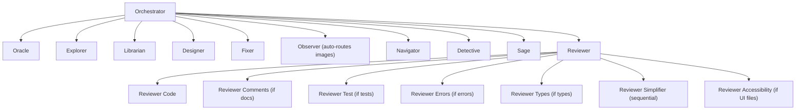
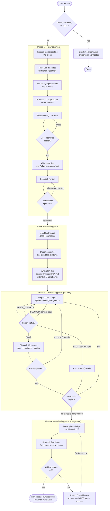

# AI Rules Architecture Overview

Interactive visualization of agents, MCPs, tools, skills, and infrastructure in the ai-rules system.

**🔗 [Open Visualization](./index.html)** — Click to view the full architecture diagram in your browser.

## Files

- `index.html` — Interactive visualization engine (loads data dynamically from YAML)
- `data.yaml` — All node and configuration data (edit this to change the graph)
- `README.md` — This file

## Quick Start

The page uses `fetch()` to load `data.yaml`, so it must be served over HTTP (not opened as a `file://` URL).

```sh
# Serve and open in browser (runs on http://localhost:8888)
./agents-overview/serve.sh
```

Click any card to expand and see detailed information — constraints, responsibilities, tools, and configuration.

## Dispatch Graph

The following static Mermaid diagram is the high-level agent-to-agent dispatch map. The rendered version appears above the cards in `index.html`; it intentionally excludes MCPs, skills, tools, infrastructure, runtime data, and card interactions.



## Using the Visualization

**Navigation:**

- **Click cards** to expand/collapse and see full details
- **Scroll** to browse all sections
- **Responsive** — works on desktop and mobile

**Color coding:**

- Blue boxes — Agents
- Purple badges — MCPs
- Green badges — Tools
- Amber badges — Skills
- Pink boxes — Infrastructure

## Updating the Architecture

Edit `data.yaml` to keep the visualization in sync with your system. No code changes needed.

### Node Fields

```yaml
nodes:
  - id: unique-id                 # Required: unique identifier
    label: Display Name            # Required: shown in UI
    type: agent|mcp|tool|skill|infra  # Required: node category
    role: Brief role description   # Required: 1-line summary
    color: '#hexcolor'             # Required: badge/box color
    parent: parent-id              # Optional: nesting (agent contains MCPs)
    trigger: When to dispatch      # Agents: conditions for dispatch
    tools: Tool names              # Agents: available MCPs/tools
    constraints: Cannot access X   # Agents: access restrictions
    responsibilities: What it does # Agents: bullet-point list
    description: Brief description # Tools/Skills: what it does
    used_by: Which agents          # Tools: who uses it
    when: When to invoke           # Skills: when to use
    location: File path            # Infrastructure: config location
    config: Configuration details  # Infrastructure: setup details
```

### Adding an Agent

```yaml
nodes:
  - id: my-agent
    label: my-agent
    type: agent
    role: Specific purpose
    color: '#60a5fa'
    parent: main
    trigger: Conditions to dispatch
    tools: List of available MCPs
    constraints: Access restrictions
    responsibilities: |
      • Responsibility 1
      • Responsibility 2
```

### Adding an MCP

```yaml
nodes:
  - id: my-mcp
    label: my-mcp-name
    type: mcp
    role: What it provides
    color: '#a78bfa'
    parent: agent-id  # Which agent owns it
```

### Adding a Tool

```yaml
nodes:
  - id: my-tool
    label: My Tool
    type: tool
    role: What it does
    color: '#34d399'
    parent: null
    description: Detailed description
    used_by: Which agents use it
```

### Adding Infrastructure

```yaml
nodes:
  - id: my-config
    label: Config Name
    type: infra
    role: What it configures
    color: '#f472b6'
    parent: null
    location: ~/.config/file.json
    config: |
      • Configuration option 1
      • Configuration option 2
```

## Maintenance & Sync

### When to Update `data.yaml`

Update the visualization whenever you change:

- Add/remove/rename agents in `agents/`
- Modify MCPs or tool access in `CLAUDE.md`
- Change subagent dispatch rules in `agents/routing.md`
- Update infrastructure/config in `MCP_SERVERS.md`
- Modify skills in the global rules

### Claude Instruction

Add this reminder to CLAUDE.md or your memory:

```markdown
## Architecture Visualization

Keep `agents-overview/data.yaml` in sync with agent/MCP/tool changes:

- Agent added? → update nodes, add trigger/constraints/responsibilities
- MCP access changed? → update parent/constraints
- Dispatch rules modified? → update agent's trigger conditions
- Tool permissions updated? → update tool's used_by field
- Infrastructure config changed? → update infra node details

Changes are immediately reflected in the visualization at `agents-overview/index.html`.
```

### Quick Reference

After any agent/MCP/tool changes:

1. Edit `agents-overview/data.yaml`
2. Refresh `index.html` in browser
3. Verify visualization matches actual system

No code needed—YAML drives everything.

## Architecture

### Agents

**Built-in (Pantheon):**
- **orchestrator** — Master delegator; plans, implements directly, dispatches subagents
- **oracle** — Strategic advisor; architecture review, hard debugging, code review
- **explorer** — Codebase reconnaissance; broad searches, pattern discovery
- **librarian** — Knowledge retrieval; library docs (context7), web search, Linear, Notion, GitHub code search
- **designer** — UI/UX implementation; visual components, frontend polish, Figma Desktop
- **fixer** — Bounded implementation; scoped bug fixes, mechanical code changes
- **observer** — Visual analysis; images, screenshots, PDFs (auto-routed from orchestrator)

**Custom:**
- **navigator** — Browser automation; navigation, screenshots, DOM, form fills
- **detective** — Production diagnostics; Sentry, Datadog (pup CLI), GCP logs, Rootly, root cause analysis
- **sage** — Domain knowledge; Gorgias metrics, table schemas, business rules (cortex/context-layer)

### MCPs (Model Context Protocol)

**orchestrator:**
- **codebase-memory-mcp** — Code search, graph-based exploration (shared by oracle, explorer, fixer, designer, detective, sage)
- **github** — GitHub CLI integration (PRs, issues, checks)

**librarian:**
- **context7** — Current library documentation
- **websearch** — Web search via Exa
- **gh_grep** — GitHub code search across repos
- **linear** — Issues, epics, cycles (read-only)
- **notion** — Design docs, specs, runbooks (read-only)

**designer:**
- **figma-desktop** — Design files (local Figma Desktop app, http://127.0.0.1:3845/mcp)

**navigator:**
- **mcp-server-browser** — Browser navigation, screenshots, interaction

**detective:**
- **sentry** — Error monitoring (read-only)
- **pup CLI** — Datadog CLI (--agent --ro): logs, metrics, APM, monitors
- **gcp-logging** — GCP Cloud Logging
- **rootly** — Incident management data

**sage:**
- **context-layer** — Gorgias domain knowledge, metrics, BigQuery

### Tools
- **Bash** — Command execution (all agents)
- **Read/Edit/Write** — File operations (orchestrator, fixer, designer)
- **Git** — Version control (orchestrator)
- **gh CLI** — GitHub integration (orchestrator)

### Skills

**Orchestrator:**
- **codemap** — Repository cartography
- **deepwork** — Heavy session workflow
- **verification-planning** — Evidence before code
- **worktrees** — Isolated coding lanes
- **clonedeps** — Dependency X-ray
- **reflect** — Workflow self-improvement
- **oh-my-opencode-slim** — Plugin self-configuration
- **project-context** — Project summaries
- **openspec-propose / apply / archive / explore / update / sync** — SDD workflow

**Oracle:**
- **simplify** — Behavior-preserving refactors

**Detective:**
- **dd-pup** — Datadog CLI reference
- **dd-apm** — APM traces & services
- **dd-logs** — Log search & management
- **dd-monitors** — Monitor alerting
- **dd-debugger** — Live debugger probes
- **incident-response** — Incident tracking & on-call

### Infrastructure
- **OpenCode** — Entry point, OMO Slim plugin host
- **Oh My OpenCode Slim** — Agent orchestration (preset: bifrost)
- **Bifrost** — Model gateway (https://bifrost.ops.gorgias.io)
- **RTK** — Token optimization plugin (~60-90% reduction)
- **zsh Environment** — Shell config (VOLTA_HOME, GORGIAS_ROOT, aliases)

## SDD Workflow — How the Plan Works

The orchestrator defaults to Spec Driven Development (SDD) for any non-trivial
work. It's a 4-phase pipeline, each phase backed by a skill
(`brainstorming` → `writing-plans` → `executing-plans` → `reviewing-plans`),
with a fast-path bypass for trivial/hotfix changes.



**Key rules baked into the flow:**

- The **only** exit from `brainstorming` is loading `writing-plans` — no code is written before a design is approved.
- `executing-plans` uses a **fresh agent per task** with isolated context, never inheriting orchestrator session history.
- The fix loop in Phase 3 is capped at **3 rounds** before escalating to `@oracle`.
- Phase 4 is a hard **merge gate**: any Critical issue blocks the "success" signal, regardless of how many tasks completed.

## Constraints

**Orchestrator hard-enforced dispatch rules (no direct access):**
- mcp-server-browser → dispatch to navigator
- sentry, gcp-logging, rootly → dispatch to detective
- context-layer → dispatch to sage
- linear, notion → dispatch to librarian

This enforces proper tool isolation and prevents unauthorized access.
