# SDD Workflow — End to End

```mermaid
flowchart TD
    START([Non-trivial task received])
    SKIP["User says 'trivial', 'quick fix', 'just do it'?"]
    DIRECT["Implement directly"]

    START --> SKIP
    SKIP -->|yes| DIRECT
    SKIP -->|no| B1

    subgraph PHASE1["🧠 Phase 1: Brainstorming"]
        direction TB
        B1["Load skill: brainstorming"]
        B2["@explorer — codebase recon"]
        B3["@librarian — external research"]
        B4["Ask clarifying questions\n(one at a time)"]
        B5["Propose 2-3 approaches\nwith trade-offs"]
        B6["@oracle — architecture assessment"]
        B7["Present design sections\n@designer for UI-heavy sections"]
        B8{"User approves design?"}
        B9["Save spec:\ndocs/.planning/specs/\nYYYY-MM-DD-<topic>-design.md"]
        B10["Spec self-review\n(placeholders, consistency, scope)"]
        B11{"User approves spec?"}

        B1 --> B2
        B2 --> B3
        B3 --> B4
        B4 --> B5
        B5 -->|architecture decisions| B6
        B6 --> B7
        B5 --> B7
        B7 --> B8
        B8 -->|no, revise| B7
        B8 -->|yes| B9
        B9 --> B10
        B10 --> B11
        B11 -->|changes requested| B9
        B11 -->|approved| P1
    end

    subgraph PHASE2["📋 Phase 2: Writing Plans"]
        direction TB
        P1["Load skill: writing-plans"]
        P2["Map file structure\n(boundaries, responsibilities)"]
        P3["Decompose into bite-sized tasks\n(2-5 min each, TDD)"]
        P4["Write plan:\n- Exact file paths\n- Complete code\n- Test commands\n- NO placeholders"]
        P5["Self-review:\nspec coverage, placeholder scan,\ntype consistency"]
        P6["Save plan:\ndocs/.planning/plans/\nYYYY-MM-DD-<feature>.md"]
        P7{"User approves plan?"}

        P1 --> P2
        P2 --> P3
        P3 --> P4
        P4 --> P5
        P5 --> P6
        P6 --> P7
        P7 -->|no, revise| P4
        P7 -->|yes| E1
    end

    subgraph PHASE3["⚡ Phase 3: Executing Plans"]
        direction TB
        E1["Load skill: executing-plans"]
        E2["Create ledger:\ndocs/.planning/\nledger-<plan>.md"]
        E3["Read plan, create todos"]
        E4["Scan for pre-flight conflicts"]
        E5["Dispatch implementer\n@fixer (code) / @designer (UI)"]
        E6{"Implementer status?"}
        E7["Provide context,\nre-dispatch"]
        E8["Task blocked:\nassess + escalate\nto @oracle if needed"]
        E9["Dispatch @reviewer\nper-task review"]
        E10{"Review: spec ✅\nquality approved?"}
        E11["Fix loop\n(rounds 1-2: same agent\nround 3: fresh agent)"]
        E12{"Round 3 still failing?"}
        E13["Escalate to @oracle:\nplan adjustment\nor defer"]
        E14["Append to ledger:\nTask N complete"]
        E15{"More tasks?"}
        E16["Commit ledger"]

        E1 --> E2
        E2 --> E3
        E3 --> E4
        E4 --> E5
        E5 --> E6
        E6 -->|NEEDS_CONTEXT| E7
        E7 --> E5
        E6 -->|BLOCKED| E8
        E8 --> E5
        E6 -->|DONE| E9
        E9 --> E10
        E10 -->|yes| E14
        E10 -->|no| E11
        E11 --> E12
        E12 -->|no| E5
        E12 -->|yes| E13
        E13 --> E14
        E14 --> E15
        E15 -->|yes| E5
        E15 -->|no| E16
        E16 --> R1
    end

    subgraph PHASE4["🔍 Phase 4: Reviewing Plans"]
        direction TB
        R1["Load skill: reviewing-plans"]
        R2["Gather context:\nplan file + ledger +\nfull branch diff"]
        R3["Dispatch @reviewer\n(7 reviewer-* specialists\nin parallel)"]
        R4["@reviewer returns\nstructured report"]
        R5{"Critical issues = 0?"}
        R6["✅ Plan executed\nwith success\n\nReport to orchestrator:\n- Tasks completed\n- Review summary\n- Strengths\n- Merge ready"]
        R7["❌ Gate not passed\n\nReport to orchestrator:\n- Critical issues\n- Recommended fixes\n- Do NOT signal\ncompletion"]

        R1 --> R2
        R2 --> R3
        R3 --> R4
        R4 --> R5
        R5 -->|yes| R6
        R5 -->|no| R7
    end

    style START fill:#e1f5fe,stroke:#01579b
    style R6 fill:#e8f5e9,stroke:#2e7d32,stroke-width:3px
    style R7 fill:#ffebee,stroke:#c62828,stroke-width:3px
    style DIRECT fill:#fff3e0,stroke:#e65100
    style B8 fill:#fff9c4,stroke:#f57f17
    style B11 fill:#fff9c4,stroke:#f57f17
    style P7 fill:#fff9c4,stroke:#f57f17
    style E6 fill:#fff9c4,stroke:#f57f17
    style E10 fill:#fff9c4,stroke:#f57f17
    style E12 fill:#fff9c4,stroke:#f57f17
    style E15 fill:#fff9c4,stroke:#f57f17
    style R5 fill:#fff9c4,stroke:#f57f17
```

## Agent Usage by Phase

| Phase | @explorer | @librarian | @oracle | @designer | @fixer | @reviewer |
|---|---|---|---|---|---|---|
| 1. Brainstorming | ✅ codebase recon | ✅ external research | ✅ architecture | ✅ UI sections | — | — |
| 2. Writing Plans | ✅ context | ✅ research | ✅ architecture | ✅ UI planning | — | — |
| 3. Executing | — | — | ✅ escalation | ✅ UI tasks | ✅ code tasks | ✅ per-task gate |
| 4. Reviewing | — | — | — | — | — | ✅ final gate (all 7 specialists) |
