# SDD Workflow — T-Shirt Sizing End to End

```mermaid
flowchart TD
    START([Task received])
    SIZE["Always report first:\nT-shirt size: XS | S | M | L | XL\n+ short rationale"]
    TRIAGE{"T-shirt size?"}
    DIRECT["Immediate implementation\n@fixer (code) / @designer (UI/UX)\n(no approval, planning artifact, SDD, or reviewer)"]
    DONE([Complete])

    START --> SIZE
    SIZE --> TRIAGE
    TRIAGE -->|XS| XS1
    TRIAGE -->|S/M| SM1
    TRIAGE -->|L/XL| LX1

    subgraph XS["XS path"]
        direction TB
        XS1["Obvious isolated reversible edit"]
        XS1 --> DIRECT
    end

    subgraph SM["S/M path"]
        direction TB
        SM1["S: small local established-pattern work\nM: cohesive bounded work across related files\n(no architecture/security/migration/data-integrity/\nexternal-integration uncertainty)"]
        SM2["Write one concise merged SDD + implementation plan\n~/developer/planning-docs/{{repository-name}}/.planning/plans/"]
        SM3["Show plan once"]
        SM4{"Approve plan once?"}
        SM5["Dispatch implementation\n@fixer (code) / @designer (UI/UX)"]
        SM6["Automatically run exactly one review gate\nOpenCode: orchestrator-managed review-pipeline\npost-implementation"]
        SM8["Proportionate validation\n(no separate spec, executing-plans, ledger,\nor per-task review loop or review-choice prompt)"]
        SM7["Revise, clarify, or defer"]

        SM1 --> SM2
        SM2 --> SM3
        SM3 --> SM4
        SM4 -->|yes| SM5
        SM5 --> SM6
        SM6 --> SM8
        SM8 --> DONE
        SM4 -->|no| SM7
    end

    subgraph LX["L/XL path — full SDD"]
        direction TB
        LX1["L: multi-area/cross-system or material uncertainty\nXL: architecture, migration, security/data-integrity,\nproduction-impact, or major external-dependency work"]
        LX1 --> B1
    end

    subgraph PHASE1["🧠 L/XL — Phase 1: Brainstorming"]
        direction TB
        B1["Load skill: brainstorming"]
        B2["@explorer — codebase recon"]
        B3["@librarian — external research"]
        B4["Ask clarifying questions\n(one at a time)"]
        B5["Propose 2-3 approaches\nwith trade-offs"]
        B6["@oracle — architecture assessment"]
        B7["Show separate design/spec\n@designer for UI-heavy sections"]
        B9["Save design/spec:\n~/developer/planning-docs/{{repository-name}}/.planning/specs/"]
        B10["Spec self-review\n(placeholders, consistency, scope)"]
        B11{"User approves spec?"}

        B1 --> B2
        B2 --> B3
        B3 --> B4
        B4 --> B5
        B5 -->|architecture decisions| B6
        B6 --> B7
        B5 --> B7
        B7 --> B9
        B9 --> B10
        B10 --> B11
        B11 -->|changes requested| B9
        B11 -->|approved| P1
    end

    subgraph PHASE2["📋 L/XL — Phase 2: Writing Plans"]
        direction TB
        P1["Load skill: writing-plans"]
        P2["Map file structure\n(boundaries, responsibilities)"]
        P3["Decompose into bite-sized tasks\n(2-5 min each, TDD)"]
        P4["Write implementation plan:\n- Exact file paths\n- Complete code\n- Test commands\n- NO placeholders"]
        P5["Self-review:\nspec coverage, placeholder scan,\ntype consistency"]
        P6["Save implementation plan:\n~/developer/planning-docs/{{repository-name}}/.planning/plans/"]
        P7{"User approves plan?"}

        P1 --> P2
        P2 --> P3
        P3 --> P4
        P4 --> P5
        P5 --> P6
        P6 --> P7
        P7 -->|no, revise| P4
        P7 -->|yes| E1
    end

    subgraph PHASE3["⚡ L/XL — Phase 3: Executing Plans"]
        direction TB
        E1["Load skill: executing-plans"]
        E2["Create ledger:\n~/developer/planning-docs/{{repository-name}}/.planning/\nledger-<plan>.md"]
        E3["Read plan, create todos"]
        E4["Scan for pre-flight conflicts"]
        E5["Dispatch ready implementers\nup to 3 disjoint @fixer children\nbackground=true; @designer as needed"]
        E5A["Wait for same batch\nreconcile exact child session IDs\nwith task_result"]
        E6{"Implementer status?"}
        E7["Provide context,\nre-dispatch"]
        E8["Task blocked:\nassess + escalate\nto @oracle if needed"]
        E9["Run per-child review gate\nOpenCode: orchestrator-managed review-pipeline"]
        E10{"Review: spec ✅\nquality approved?"}
        E11["Fix loop\n(rounds 1-2: same agent\nround 3: fresh agent)"]
        E12{"Round 3 still failing?"}
        E13["Escalate to @oracle:\nplan adjustment\nor defer"]
        E14["Append to ledger:\nTask N complete"]
        E15{"More tasks?"}
        E16["Commit ledger"]
        E17{"Ask user: run final\ncomprehensive review?"}
        E18["Complete execution\nwithout final review"]

        E1 --> E2
        E2 --> E3
        E3 --> E4
        E4 --> E5
        E5 --> E5A
        E5A --> E6
        E6 -->|NEEDS_CONTEXT| E7
        E7 --> E5
        E6 -->|BLOCKED| E8
        E8 --> E5
        E6 -->|DONE| E9
        E9 --> E10
        E10 -->|yes| E14
        E10 -->|no| E11
        E11 --> E12
        E12 -->|no| E5
        E12 -->|yes| E13
        E13 --> E14
        E14 --> E15
        E15 -->|yes| E5
        E15 -->|no| E16
        E16 --> E17
        E17 -->|yes — explicit opt-in| R1
        E17 -->|no — skip| E18
        E18 --> DONE
    end

    subgraph PHASE4["🔍 L/XL — Phase 4: Reviewing Plans"]
        direction TB
        R1["Load skill: reviewing-plans"]
        R2["Gather context:\nplan file + ledger +\nfull branch diff"]
        R3["Orchestrator loads review-pipeline\nvalidates registry and immutable packet\nPhase A: registry lanes in batches ≤ resolved cap\n(max 3), wait for exact sessions\nPhase B: simplifier exactly once, sequentially\nNo unlisted-lane fallback"]
        R4["Orchestrator returns\nstructured report"]
        R5{"Critical issues = 0?"}
        R6["✅ Plan executed\nwith success\n\nReport to orchestrator:\n- Tasks completed\n- Review summary\n- Strengths\n- Merge ready"]
        R7["❌ Gate not passed\n\nReport to orchestrator:\n- Critical issues\n- Recommended fixes\n- Do NOT signal\ncompletion"]

        R1 --> R2
        R2 --> R3
        R3 --> R4
        R4 --> R5
        R5 -->|yes| R6
        R5 -->|no| R7
        R6 --> DONE
    end

    style START fill:#e1f5fe,stroke:#01579b
    style DONE fill:#e8f5e9,stroke:#2e7d32,stroke-width:3px
    style DIRECT fill:#fff3e0,stroke:#e65100
    style SIZE fill:#fff9c4,stroke:#f57f17
    style TRIAGE fill:#fff9c4,stroke:#f57f17
    style SM4 fill:#fff9c4,stroke:#f57f17
    style B11 fill:#fff9c4,stroke:#f57f17
    style P7 fill:#fff9c4,stroke:#f57f17
    style E6 fill:#fff9c4,stroke:#f57f17
    style E10 fill:#fff9c4,stroke:#f57f17
    style E12 fill:#fff9c4,stroke:#f57f17
    style E15 fill:#fff9c4,stroke:#f57f17
    style E17 fill:#fff9c4,stroke:#f57f17
    style R5 fill:#fff9c4,stroke:#f57f17
```

## T-shirt sizing policy

### Bounded fixer batches

During L/XL execution, OpenCode uses one orchestrator-owned scheduler with a
maximum of **3** concurrent `@fixer` children. A batch is eligible only when
each task has complete `Files` ownership and dependency metadata and the write
sets are disjoint. Any overlap, ambiguity, shared resource, generated output,
lockfile, or explicit ordering is serialized. Every child uses
`background=true`; the orchestrator waits for the same batch and reconciles by
the exact returned session ID through `task_result`.

`Files` is a hard allowlist for create/modify/delete operations. Since OpenCode
cannot install dynamic path ACLs, this is cooperative prompt enforcement with
changed-path verification; unowned changes fail closed. Every `DONE` child gets
its own reviewer gate before a dependent is released. `NEEDS_CONTEXT`,
`BLOCKED`, timeout, failure, missing, or malformed implementer/reviewer output
holds dependents and is surfaced rather than treated as success. Reviewer
concurrency remains separate from the fixer cap.

Always evaluate and visibly report `T-shirt size: XS | S | M | L | XL` with a
short rationale first, before exploration or implementation:

- **XS** — obvious isolated reversible edit. Immediately dispatch implementation
  to `@fixer` for code or `@designer` for UI/UX as appropriate; no approval,
  planning artifact, SDD, or reviewer.
- **S** — small local work following an established pattern.
- **M** — cohesive bounded work across related files without
  architecture/security/migration/data-integrity/external-integration
  uncertainty.
- **S/M** — use one concise merged SDD + implementation plan in
  `~/developer/planning-docs/{{repository-name}}/.planning/plans/`, show it once, and obtain one approval before dispatching implementation to
  `@fixer` for code or `@designer` for UI/UX as appropriate. Automatically
  run exactly one post-implementation review gate through OpenCode
  `orchestrator-managed review-pipeline`, then run proportionate
  validation. Do not create a separate spec, load `executing-plans`, create a
  ledger, run a per-task review, or prompt for a review choice.
- **L** — multi-area/cross-system work or material uncertainty.
- **XL** — architecture, migration, security/data-integrity, production-impact,
  or major external-dependency work.
- **L/XL** — use full SDD. Show and approve a separate design/spec in
  `~/developer/planning-docs/{{repository-name}}/.planning/specs/` before writing the implementation plan in
  `~/developer/planning-docs/{{repository-name}}/.planning/plans/`; retain plan approval and the existing
  execution/review flow.

## Agent Usage by Phase

| T-shirt path / phase           | @explorer         | @librarian           | @oracle               | @designer         | @fixer                      | Review manager                   |
| ------------------------------ | ----------------- | -------------------- | --------------------- | ----------------- | --------------------------- | --------------------------------- |
| XS/immediate                   | —                 | —                    | —                     | ✅ UI/UX implementation | ✅ code implementation     | —                                 |
| S/M merged plan                | optional context  | optional research    | optional architecture | ✅ UI/UX implementation | ✅ code implementation     | ✅ one automatic post-implementation gate (`orchestrator-managed review-pipeline`) |
| L/XL — 1. Brainstorming        | ✅ codebase recon | ✅ external research | ✅ architecture       | ✅ UI sections    | —                           | —                                 |
| L/XL — 2. Writing Plans        | ✅ context        | ✅ research          | ✅ architecture       | ✅ UI planning    | —                           | —                                 |
| L/XL — 3. Executing            | —                 | —                    | ✅ escalation         | ✅ UI tasks       | ✅ code tasks               | ✅ per-task review (`orchestrator-managed review-pipeline`) |
| L/XL — 4. Reviewing (optional) | —                 | —                    | —                     | —                 | —                           | ✅ final gate (all 10 specialists; `orchestrator-managed review-pipeline`) |
